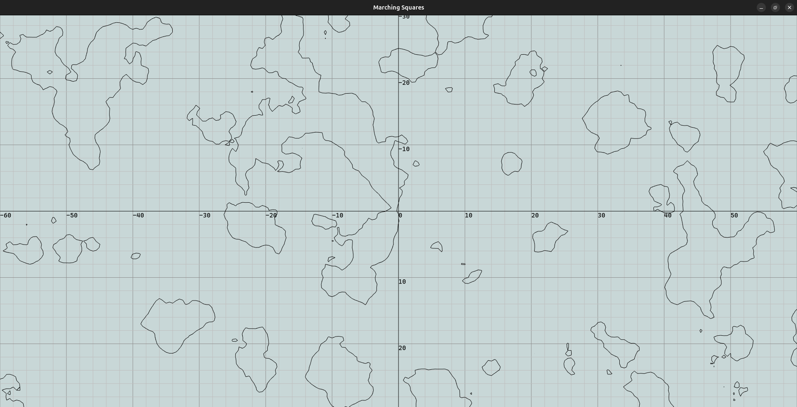

# Marching Squares
Marching squares is an algorithm that reconstructs a figure from a function of 2D parameters. This project is part of some research that I'm doing on scanners, so it's adapted from another repository. \
The project is made with C++17, CMake and SFML for the graphics.

## Usage
First, to build the project you either:
- ```bash ./Build.sh``` if you're on Linux or MacOS
- ```./Build.bat``` if you're on Windows

Then, the project should be on the ```build``` folder (```build/MarchingSquares```)

## Screenshots
<!-- TODO: Add another image of a simple function with the points inside and outside -->




## External libraries
There is no need to have them installed, CMake will do it:
- [SFML](https://github.com/SFML/SFML) for all the graphic applications.
- [siv::PerlinNoise](https://github.com/Reputeless/PerlinNoise) for the Perlin Noise in some screenshots
